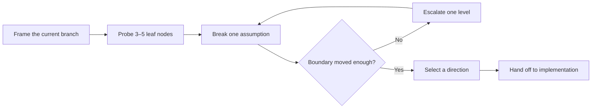

<div align="center">

# Unbox Me

**Reopen the design space before polishing the wrong branch.**

[](unbox-me/SKILL.md)
[](LICENSE)

English · [简体中文](README.zh-CN.md)

</div>

## Why Unbox Me?

AI is very good at making the first plausible direction look finished. The polish can hide a more important question: **did we choose the right branch at all?**

Unbox Me interrupts premature convergence. It helps you expose the assumption holding a design in place, test vague dissatisfaction with concrete contrasts, and explore structurally different directions before implementation makes the current path expensive to leave.

> [!IMPORTANT]
> Unbox Me is not a prompt for producing a longer list of ideas. It is a process for discovering when many ideas are still variants of the same underlying structure.

## At a glance

| When you notice… | Unbox Me will… | So you can… |
| --- | --- | --- |
| “It is polished, but generic.” | Separate fixed constraints from hidden assumptions | Change the structure, not just the styling |
| Brainstorming keeps circling one idea | Create small, contrasting diagnostic probes | Find the branch that produces a useful reaction |
| A system is accumulating patches | Expose the assumption holding the branch in place | Reconsider the architecture before adding more machinery |
| You cannot explain what feels wrong | Ask for **closer / farther / irrelevant** comparisons | Respond to concrete alternatives instead of abstract questions |

## How it works



Each break must change the structure in one of three ways:

| Move | Question | Typical effect |
| --- | --- | --- |
| **Delete** | What if this assumption or element did not exist? | Removes inherited complexity |
| **Reverse** | What if its role, goal, order, or relationship ran the other way? | Reveals asymmetries and neglected actors |
| **Replace** | What different structure could serve the underlying need? | Opens a genuinely new branch |

If none of the breaks moves the boundary far enough, the skill escalates exactly one level:

**detail → component → system → objective → problem frame**

## Example prompts

| Use case | Try this |
| --- | --- |
| Product interface | `This dashboard is polished but generic. Use $unbox-me before changing the visuals.` |
| Software architecture | `Use $unbox-me to check whether our queues and caches are optimizing the wrong architecture.` |
| Brand campaign | `The campaign is professional but forgettable. Use $unbox-me on the creative direction.` |
| Story development | `This premise keeps becoming a standard thriller. Use $unbox-me without adding random twists.` |
| Product strategy | `We are building another habit tracker. Use $unbox-me before we write the roadmap.` |
| Writing and research | `The argument is coherent but unsurprising. Use $unbox-me before drafting.` |

See [the detailed use cases](unbox-me/references/use-cases.md) for the current assumptions, structural breaks, and reasoning behind each example.

## Install

Clone the repository:

```bash
git clone https://github.com/Octmoe/unbox-me.git
```

Copy the inner [`unbox-me`](unbox-me) directory into your Codex skills directory:

```text
~/.codex/skills/unbox-me/
```

The installed folder should contain `SKILL.md` directly:

```text
~/.codex/skills/unbox-me/SKILL.md
```

Restart Codex if the skill does not appear immediately.

## Use

Invoke the skill explicitly:

```text
Use $unbox-me to reopen this idea before we settle on a direction.
```

Codex can also select it automatically when a creative, design, strategy, architecture, or writing task shows signs of premature convergence.

## Repository layout

```text
unbox-me/
├── LICENSE
├── README.md
├── README.zh-CN.md
└── unbox-me/
    ├── SKILL.md
    ├── agents/
    │   └── openai.yaml
    └── references/
        └── use-cases.md
```

## License

Released under the [MIT License](LICENSE).
