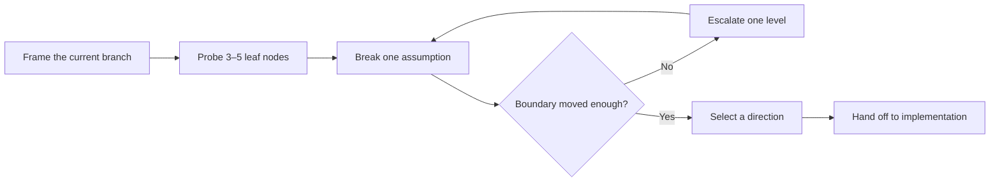

<div align="center">

# Unbox Me

**Reopen the design space before polishing the wrong branch.**

[](unbox-me/SKILL.md)
[](LICENSE)

English · [简体中文](README.zh-CN.md)

</div>

## Why Unbox Me?

AI is very good at making the first plausible direction look finished. The polish can hide a more important question: **did we choose the right branch at all?**

Unbox Me interrupts premature convergence. It helps you expose the assumption holding a design in place, test vague dissatisfaction with concrete contrasts, and explore structurally different directions before implementation makes the current path expensive to leave.

## At a glance

| When you notice… | Unbox Me will… | So you can… |
| --- | --- | --- |
| “It is polished, but generic.” | Separate fixed constraints from hidden assumptions | Change the structure, not just the styling |
| Brainstorming keeps circling one idea | Create small, contrasting diagnostic probes | Find the branch that produces a useful reaction |
| A system is accumulating patches | Expose the assumption holding the branch in place | Reconsider the architecture before adding more machinery |
| You cannot explain what feels wrong | Ask for **closer / farther / irrelevant** comparisons | Respond to concrete alternatives instead of abstract questions |

## Recommended: let your agent install and explain it

If the current agent can access the network and write to the local filesystem, this is the easiest way to start:

```text
Install the Unbox Me skill from https://github.com/Octmoe/unbox-me into this environment's local skills directory. Preserve the inner unbox-me directory structure, make sure SKILL.md is directly inside the installed skill folder, and verify that the skill can be discovered and invoked after installation. Once it is ready, briefly explain what Unbox Me does, when I should use it, and give one example based on my current work.
```

The agent may ask for permission before downloading or writing files.

## Prompt-only version

If the skill is not installed, copy and paste this prompt directly:

```text
Perform a design unboxing process on the current design.

The design appears to have converged, but I am still dissatisfied and may not be able to explain exactly why.

First, infer 3 to 5 potentially problematic leaf nodes from different branches of the design tree. Treat them as hypotheses, not facts. For each node, propose one small, contrasting change so I can judge whether it feels closer, farther away, or irrelevant.

Once a likely node is found, identify the assumption holding it in place. Provide structural alternatives by deleting, reversing, or replacing that assumption. Do not merely patch, fine-tune, or rename the existing design.

If the change is still not enough, move up exactly one level:

detail → component → system → objective → problem frame

Treat only the constraints I explicitly declare non-negotiable as fixed. Stop as soon as a meaningful new direction emerges, then summarize what was preserved, what was broken, and what new possibilities were opened.
```

## How it works



Each break must change the structure in one of three ways:

| Move | Question | Typical effect |
| --- | --- | --- |
| **Delete** | What if this assumption or element did not exist? | Removes inherited complexity |
| **Reverse** | What if its role, goal, order, or relationship ran the other way? | Reveals asymmetries and neglected actors |
| **Replace** | What different structure could serve the underlying need? | Opens a genuinely new branch |

If none of the breaks moves the boundary far enough, the skill escalates exactly one level:

**detail → component → system → objective → problem frame**

## Example prompts

| Use case | Try this |
| --- | --- |
| Product interface | `This dashboard is polished but generic. Use $unbox-me before changing the visuals.` |
| Software architecture | `Use $unbox-me to check whether our queues and caches are optimizing the wrong architecture.` |
| Brand campaign | `The campaign is professional but forgettable. Use $unbox-me on the creative direction.` |
| Story development | `This premise keeps becoming a standard thriller. Use $unbox-me without adding random twists.` |
| Product strategy | `We are building another habit tracker. Use $unbox-me before we write the roadmap.` |
| Writing and research | `The argument is coherent but unsurprising. Use $unbox-me before drafting.` |

See [the detailed use cases](unbox-me/references/use-cases.md) for the current assumptions, structural breaks, and reasoning behind each example.

## Install

Clone the repository:

```bash
git clone https://github.com/Octmoe/unbox-me.git
```

Copy the inner [`unbox-me`](unbox-me) directory into your Codex skills directory:

```text
~/.codex/skills/unbox-me/
```

The installed folder should contain `SKILL.md` directly:

```text
~/.codex/skills/unbox-me/SKILL.md
```

Restart Codex if the skill does not appear immediately.

## Use

Invoke the skill explicitly:

```text
Use $unbox-me to reopen this idea before we settle on a direction.
```

Codex can also select it automatically when a creative, design, strategy, architecture, or writing task shows signs of premature convergence.

## Use with other agent harnesses

Unbox Me is intentionally lightweight: it has no scripts, model-specific tool calls, or external service dependencies. Its behavior lives in [`unbox-me/SKILL.md`](unbox-me/SKILL.md), while the use cases are optional references. Most harnesses that support reusable instructions or prompt modules can adapt it with little work:

1. Copy the `SKILL.md` instructions into the harness's skill or instruction format.
2. Adapt the frontmatter and trigger description to the harness's registration convention.
3. Replace the explicit `$unbox-me` invocation with that harness's invocation syntax.
4. Keep `references/use-cases.md` as an optional example library.
5. Use the [prompt-only version](#prompt-only-version) as a quick migration test.

`agents/openai.yaml` contains Codex-specific interface metadata. Other harnesses can omit it or rewrite it in their own metadata format.

If a harness has no skill system, use the prompt-only version as a reusable system, developer, or user prompt.

## Repository layout

```text
unbox-me/
├── LICENSE
├── README.md
├── README.zh-CN.md
└── unbox-me/
    ├── SKILL.md
    ├── agents/
    │   └── openai.yaml
    └── references/
        └── use-cases.md
```

## License

Released under the [MIT License](LICENSE).
