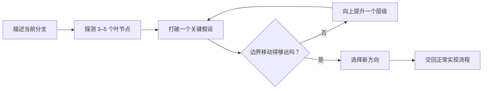

<div align="center">

# Unbox Me

**在继续润色错误分支之前，先重新打开设计空间。**

[](unbox-me/SKILL.md)
[](LICENSE)

[English](README.md) · 简体中文

</div>

## 为什么需要 Unbox Me？

AI 很擅长迅速找到第一条合理路径，并把它打磨得像最终答案。精致的完成度有时会掩盖一个更重要的问题：**我们一开始选对分支了吗？**

Unbox Me 用来打断这种过早收敛。它会找出把当前设计固定住的隐含假设，把“感觉不对”转化为可比较的具体变化，并在实现成本变高之前，重新打开结构上真正不同的方向。

## 快速了解

| 当你发现…… | Unbox Me 会…… | 从而帮助你…… |
| --- | --- | --- |
| “方案很精致，但很普通。” | 区分明确约束与隐含假设 | 改变结构，而不只是换一套样式 |
| 头脑风暴总在同一个想法附近打转 | 提供少量、彼此对照的诊断探针 | 找到真正会引发有效反应的分支 |
| 系统不断累积补丁 | 暴露维持当前分支的关键假设 | 在增加更多机制前重新考虑架构 |
| 说不清楚哪里不对 | 让你比较 **更接近 / 更远离 / 无关** | 回应具体差异，而不是解释抽象感受 |

## 工作方式



每次都通过三种结构性动作打破假设：

| 动作 | 要问的问题 | 常见效果 |
| --- | --- | --- |
| **删除（Delete）** | 如果这个假设或元素不存在，会怎样？ | 移除继承而来的复杂度 |
| **反转（Reverse）** | 如果角色、目标、顺序或关系反过来，会怎样？ | 暴露不对称关系与被忽视的参与者 |
| **替换（Replace）** | 还有什么不同结构可以满足底层需求？ | 打开真正不同的新分支 |

如果这些变化仍不足以移动边界，Skill 会严格向上提升一个层级：

**细节 → 组件 → 系统 → 目标 → 问题框架**

## 使用示例

| 场景 | 可以这样说 |
| --- | --- |
| 产品界面 | `这个数据看板很精致，但也很普通。请先用 $unbox-me 重新打开设计空间，再讨论视觉调整。` |
| 软件架构 | `我们一直在增加队列、重试和缓存。请用 $unbox-me 判断我们是否在优化错误的架构。` |
| 品牌创意 | `这个活动专业但没有记忆点。请用 $unbox-me 重新审视创意方向。` |
| 故事创作 | `这个故事总会变成普通的阴谋惊悚片。请用 $unbox-me 重新打开它，不要只是增加随机反转。` |
| 产品策略 | `我们好像又在做一个习惯追踪器。请在写路线图前使用 $unbox-me。` |
| 写作与研究 | `论证很连贯，但结构过于理所当然。请在起草前使用 $unbox-me。` |

[完整用例](unbox-me/references/use-cases.md)进一步展示了每个场景中的当前假设、结构性打破方式与推理过程。

## 安装

克隆仓库：

```bash
git clone https://github.com/Octmoe/unbox-me.git
```

将仓库内层的 [`unbox-me`](unbox-me) 目录复制到 Codex 的 Skills 目录：

```text
~/.codex/skills/unbox-me/
```

安装后的 `SKILL.md` 应该直接位于：

```text
~/.codex/skills/unbox-me/SKILL.md
```

如果 Skill 没有立即出现，请重启 Codex。

## 使用

显式调用：

```text
请使用 $unbox-me，在我们确定方向之前重新打开这个想法。
```

当创意、设计、策略、架构或写作任务出现过早收敛的迹象时，Codex 也可以自动选择这个 Skill。

## 仓库结构

```text
unbox-me/
├── LICENSE
├── README.md
├── README.zh-CN.md
└── unbox-me/
    ├── SKILL.md
    ├── agents/
    │   └── openai.yaml
    └── references/
        └── use-cases.md
```

## 开源许可

本项目使用 [MIT License](LICENSE)。
